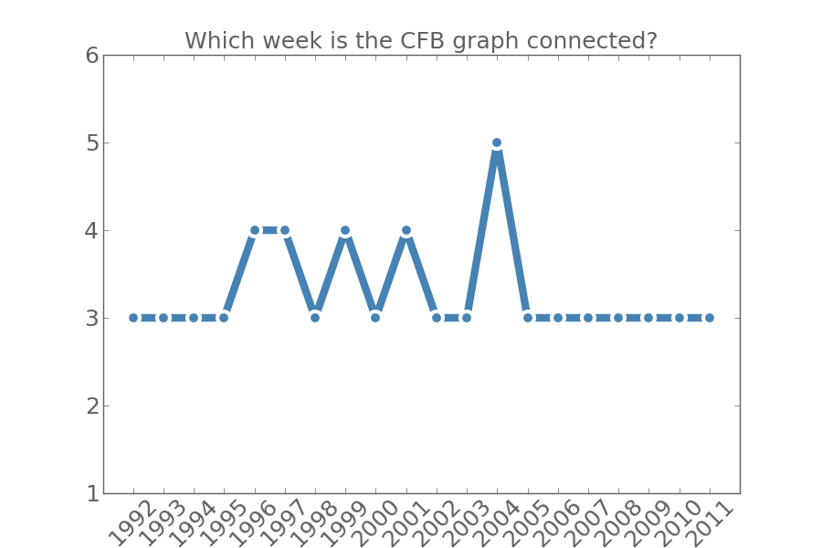

# College football data project
Collection, analysis, and visualization of college football game data in the hopes of doing something useful with it!

## Data collection
Currently scraping data from the jhowell's excellent [database](http://www.jhowell.net/cf/scores/ScoresIndex.htm) and dumping it into a JSON.

The collection script and the generated JSON database can be found in `dataCollection/`.

## Analysis
All analysis code can be found in `analysis/`.

### CFB graph connectivity
Associated files:

* `analysis/connectivity.py`
* `analysis/connectivity.png`

I define the college football graph with each node represented by a team and the edges between nodes representing a game played between those teams.

Here I look at which week in the season the college football graph becomes fully connected, meaning that there exists some path through the graph between any two nodes (teams). The hope was to use graph connectivity as a proxy to measure how teams were scheduling outside of their regional ties. Specifically, I wanted to see if the BCS introduction in 1998 influenced graph connectivity. Unfortunately, I can't say that I see anything noteworthy!

